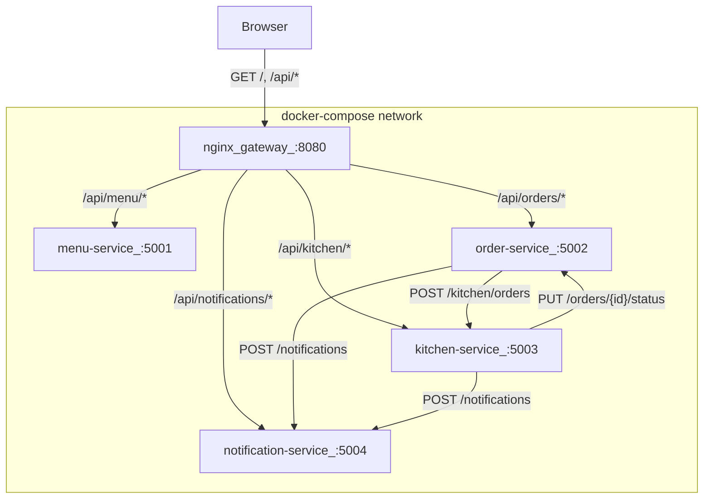

# Phase 2: Decompose into Microservices + Docker Compose

## Target Directory Structure

```
microservices/
  docker-compose.yml
  gateway/
    nginx.conf
    Dockerfile
    static/
      index.html          # copied from monolith, updated
      style.css            # copied from monolith, unchanged
      app.js               # copied from monolith, updated
  menu-service/
    main.py
    database.py
    models.py
    seed.py
    schemas.py
    Dockerfile
    requirements.txt
  order-service/
    main.py
    database.py
    models.py
    schemas.py
    Dockerfile
    requirements.txt
  kitchen-service/
    main.py
    database.py
    models.py
    schemas.py
    Dockerfile
    requirements.txt
  notification-service/
    main.py
    schemas.py
    Dockerfile
    requirements.txt
  tests/
    conftest.py
    test_contracts.py
    test_resilience.py
    requirements.txt
```

---

## Service Communication Architecture




---

## Key Architectural Decisions

### 1. Order-service denormalizes menu item data

In the monolith, `OrderItem` has a FK to `menu_items` and joins to get name/price. In microservices, order-service cannot access menu-service's DB. Solution:

- Add `item_name: str` and `unit_price: float` columns to `OrderItem` in order-service
- On order creation, order-service calls `GET http://menu-service:5001/menu` to validate items exist, are available, and fetch prices
- Prices are captured at order time (standard e-commerce pattern)

### 2. Kitchen-service calls back to order-service (required, not fire-and-forget)

In the monolith, kitchen.py directly updates `order.status`. In microservices, kitchen-service doesn't own the orders table. Solution:

- Add `PUT /orders/{order_id}/status` endpoint to order-service (accepts `{status: str}`)
- Kitchen-service calls this when cooking starts (`preparing`) and finishes (`ready`)
- **These status callbacks are required, not fire-and-forget.** If order-service is unreachable, kitchen-service must not advance its own queue state — it should return an error to the caller rather than silently leave the canonical order record out of sync. This is different from notification calls, which are genuinely secondary.
- This creates a bidirectional dependency (orders->kitchen, kitchen->orders) which is a useful teaching moment about service coupling

### 3. Notification-service is ephemeral (in-memory)

- No database, no SQLAlchemy
- Stores notifications in a plain Python list
- `POST /notifications` appends to the list and returns the created notification
- `GET /notifications` and `GET /notifications/{order_id}` read from the list
- Restarting clears all history (deliberate tradeoff)

### 4. Graceful degradation with reconciliation

- Order-service calls kitchen-service with a 3-second timeout inside try/except
- If kitchen is down, order status is set to `pending` instead of `placed`
- A background `asyncio` task in order-service runs every 30 seconds, queries for `pending` orders, and retries the kitchen call
- **Notification calls are best-effort fire-and-forget** (try/except, never blocks the primary operation)
- **Order-status callbacks from kitchen-service are required** — if order-service is unreachable, the cook endpoint fails rather than advancing kitchen queue state out of sync with the canonical order record

### 5. Database file locations under /app/data/

Each stateful service must write its SQLite file under `/app/data/` so Docker named volumes actually persist the data. Concretely:

- `database.py` in each service reads `DATABASE_PATH` env var, defaulting to `/app/data/{service}.db`
- Example: menu-service defaults to `/app/data/menu.db`, order-service to `/app/data/orders.db`, kitchen-service to `/app/data/kitchen.db`
- The monolith pattern of `BASE_DIR / 'pizza_shop.db'` (writing next to the code) must not be carried over — it would place the DB at `/app/pizza_shop.db`, outside the mounted volume

### 6. nginx serves dual duty

- Static file server: serves `index.html`, `style.css`, `app.js` at `/`
- Reverse proxy: routes `/api/menu` to `menu-service:5001/menu`, etc.
- Strips the `/api` prefix when proxying to backend services
- **Path matching uses no trailing slash** in location directives (e.g., `location /api/menu` not `location /api/menu/`) so both `/api/menu` and `/api/menu/5` are matched. The UI calls paths without trailing slashes (e.g., `api("/api/menu")`, `api("/api/orders")`), and trailing-slash-only locations would miss these.

---

## Service-by-Service Implementation Details

### A. notification-service (~70 lines)

**No database.** Simplest service to build first.

`[monolith/routers/notifications.py](monolith/routers/notifications.py)` is the starting point but needs significant changes: switch from SQLAlchemy queries to in-memory list operations, add a `POST` endpoint.

`**main.py`** key elements:

- In-memory list: `notifications: list[dict] = []` and an auto-increment counter
- `POST /notifications` — accepts `{order_id: int, message: str}`, appends to list, returns 201
- `GET /notifications` — returns list sorted newest-first
- `GET /notifications/{order_id}` — filters by order_id
- No database imports, no SQLAlchemy

`**schemas.py`**: `CreateNotificationRequest(order_id, message)`, `NotificationResponse(id, order_id, message, created_at)`

`**requirements.txt`**: `fastapi`, `uvicorn[standard]`, `pydantic`

---

### B. menu-service (~130 lines)

Closest to a direct extraction from the monolith. Carries `[monolith/routers/menu.py](monolith/routers/menu.py)`, `[monolith/models.py](monolith/models.py)` (MenuItem only), `[monolith/seed.py](monolith/seed.py)`, and `[monolith/database.py](monolith/database.py)`.

`**database.py`**: Reads `DATABASE_PATH` env var, defaults to `/app/data/menu.db`. Does **not** use the monolith pattern of `BASE_DIR / 'pizza_shop.db'`.

`**models.py`**: Only `MenuItem` — remove all other models and their relationships.

`**main.py`**: Mount the menu router at `/menu`, create tables on startup, seed menu. Runs on port 5001. No `StaticFiles` mount.

`**requirements.txt`**: `fastapi`, `uvicorn[standard]`, `sqlalchemy`, `pydantic`

---

### C. kitchen-service (~160 lines)

Extracted from `[monolith/routers/kitchen.py](monolith/routers/kitchen.py)`. Owns its own `KitchenQueue` table in `kitchen.db`. Now communicates with order-service and notification-service over HTTP.

`**models.py`**: Only `KitchenQueue` — no relationship to `Order` (just stores `order_id` as a plain integer).

**New endpoint `POST /kitchen/orders`** — receives `{order_id: int}` from order-service, creates a `KitchenQueue` entry with status `queued`. Returns 201. Idempotent: if order_id already exists, returns the existing entry.

**Modified `POST /kitchen/cook/{order_id}`** — same `time.sleep(5)` blocking pattern, but instead of directly updating Order and Notification models:

1. Calls `PUT http://order-service:5002/orders/{order_id}/status` with `{status: "preparing"}` — **required, not fire-and-forget**. If this fails, return 502 to the caller without advancing kitchen queue state.
2. Updates local `KitchenQueue` status to `cooking`, sets `started_at`
3. Calls `POST http://notification-service:5004/notifications` with the preparing message — **best-effort fire-and-forget** (try/except)
4. Sleeps 5 seconds
5. Calls `PUT http://order-service:5002/orders/{order_id}/status` with `{status: "ready"}` — **required**. If this fails, kitchen queue stays `cooking` (caller sees an error; the operation can be retried).
6. Updates local `KitchenQueue` status to `done`, sets `done_at`
7. Calls notification-service again with the ready message — **best-effort fire-and-forget**

The key invariant: kitchen queue state never advances past order-service state. Notifications are secondary and never block the cook flow.

`**requirements.txt`**: adds `httpx` for async HTTP calls

**Environment variables**: `ORDER_SERVICE_URL`, `NOTIFICATION_SERVICE_URL` (defaulting to Docker DNS names)

---

### D. order-service (~250 lines, most complex)

Extracted from `[monolith/routers/orders.py](monolith/routers/orders.py)`. This is the most substantial rewrite because of inter-service HTTP calls, graceful degradation, and the reconciliation loop.

`**models.py`**: `Order` and `OrderItem` only. Key change: `OrderItem` gains `item_name: str` and `unit_price: float` columns (denormalized from menu-service). No FK to `menu_items`. No relationships to `KitchenQueue` or `Notification`.

`**schemas.py`**: Same as monolith schemas for orders, plus:

- `UpdateOrderStatusRequest(status: str)` — for the new PUT endpoint
- `OrderItemDetailResponse` now reads `name`/`unit_price` from the stored `OrderItem` fields (not from a MenuItem join)

**Modified `POST /orders`** flow:

1. Call `GET http://menu-service:5001/menu` to fetch all menu items
2. Validate requested items exist and are available (same logic as monolith but using HTTP response data)
3. Calculate total from fetched prices
4. Create `Order` (status `placed`) and `OrderItem` rows (storing `item_name`, `unit_price`)
5. Call `POST http://kitchen-service:5003/kitchen/orders` with `{order_id}` (3s timeout, try/except)
  - On failure: set order status to `pending` instead of `placed`
6. Call `POST http://notification-service:5004/notifications` (fire-and-forget)
7. Return 201 with order detail

**New `PUT /orders/{order_id}/status`** — updates order status in DB. Called by kitchen-service. Simple: find order, update status, commit, return.

**Background reconciliation task** — started on app startup:

```python
async def reconcile_pending_orders():
    while True:
        await asyncio.sleep(30)
        # query for orders with status "pending"
        # for each, retry POST to kitchen-service
        # on success, update status from "pending" to "placed"
```

`**build_order_detail**` — simplified from monolith: no `joinedload(OrderItem.menu_item)` needed since name/price are stored on OrderItem directly.

**Environment variables**: `MENU_SERVICE_URL`, `KITCHEN_SERVICE_URL`, `NOTIFICATION_SERVICE_URL`

`**requirements.txt`**: adds `httpx`

---

### E. nginx gateway (~55 lines config)

`**nginx.conf`** key routing (no trailing slashes in location directives):

- `location /` — serves static files from `/usr/share/nginx/html/`
- `location /api/menu` — `proxy_pass http://menu-service:5001/menu` (matches `/api/menu`, `/api/menu/5`, etc.)
- `location /api/orders` — `proxy_pass http://order-service:5002/orders`
- `location /api/kitchen` — `proxy_pass http://kitchen-service:5003/kitchen`
- `location /api/notifications` — `proxy_pass http://notification-service:5004/notifications`

Each proxy block strips the `/api` prefix via nginx URI replacement (when `proxy_pass` includes a URI, nginx replaces the matched `location` prefix with it). Standard proxy headers (`X-Real-IP`, `X-Forwarded-For`, `Host`) are passed through.

`**Dockerfile`**: `FROM nginx:alpine`, copy `nginx.conf` and `static/` files.

---

### F. UI Changes (in `gateway/static/`)

Copy all 3 files from `[monolith/static/](monolith/static/)`. Changes:

`**app.js`** (~15 lines of changes):

- Add `API_BASE = "/api"` config variable at the top
- All `fetch()` paths change: `/menu` becomes `${API_BASE}/menu`, `/orders` becomes `${API_BASE}/orders`, etc. (about 8 call sites in `api()` or direct `fetch()` usages — actually all go through the `api()` helper, so changing the calls from e.g. `api("/menu")` to `api("/api/menu")` at each call site, or better: update the `api()` function to prepend the base)
- Add error handling in `loadNotifications()` for when notification-service is down (show "Notification service unavailable" instead of crashing)

`**index.html`** (~5 lines of changes):

- Change "Pizza Shop Monolith" to "Pizza Shop Microservices"
- Change hero text from "One app, one process, one shared database" to "Four services, four containers, independent deployment"
- Update hero description paragraph
- Add an ephemeral notifications banner element inside the notifications tab panel

---

### G. docker-compose.yml (~70 lines)

```yaml
services:
  gateway:
    build: ./gateway
    ports: ["8080:80"]
    depends_on:
      menu-service: { condition: service_healthy }
      order-service: { condition: service_healthy }
      kitchen-service: { condition: service_healthy }
      notification-service: { condition: service_healthy }

  menu-service:
    build: ./menu-service
    volumes: ["menu-data:/app/data"]
    healthcheck:
      test: ["CMD", "python", "-c", "import urllib.request; urllib.request.urlopen('http://localhost:5001/menu')"]
      interval: 5s
      timeout: 3s
      retries: 5

  order-service:
    build: ./order-service
    volumes: ["order-data:/app/data"]
    environment:
      MENU_SERVICE_URL: http://menu-service:5001
      KITCHEN_SERVICE_URL: http://kitchen-service:5003
      NOTIFICATION_SERVICE_URL: http://notification-service:5004
    healthcheck:
      test: ["CMD", "python", "-c", "import urllib.request; urllib.request.urlopen('http://localhost:5002/orders')"]
      interval: 5s
      timeout: 3s
      retries: 5

  kitchen-service:
    build: ./kitchen-service
    volumes: ["kitchen-data:/app/data"]
    environment:
      ORDER_SERVICE_URL: http://order-service:5002
      NOTIFICATION_SERVICE_URL: http://notification-service:5004
    healthcheck:
      test: ["CMD", "python", "-c", "import urllib.request; urllib.request.urlopen('http://localhost:5003/kitchen/queue')"]
      interval: 5s
      timeout: 3s
      retries: 5

  notification-service:
    build: ./notification-service
    healthcheck:
      test: ["CMD", "python", "-c", "import urllib.request; urllib.request.urlopen('http://localhost:5004/notifications')"]
      interval: 5s
      timeout: 3s
      retries: 5

volumes:
  menu-data:
  order-data:
  kitchen-data:
```

Each service exposes its port internally (no host port mapping except gateway). Docker DNS handles service discovery by service name. The `depends_on: condition: service_healthy` ensures the gateway only starts after all backends are actually accepting requests (not just after their containers have started). Healthchecks use `python -c "import urllib.request; ..."` instead of `curl` because `python:3.11-slim` does not include `curl`. Python's `urllib` is in the standard library and requires no extra packages. In Phase 4, these will migrate to proper `/health` endpoints.

---

### H. Contract and Resilience Tests (~200 lines)

`**tests/conftest.py**`:

- `BASE_URL` fixture from env var (default `http://localhost:8080/api`)
- Helper to wait for services to be ready
- `ORCHESTRATOR` env var for compose vs k8s commands

`**tests/test_contracts.py**` (using `httpx`):

- `GET /api/menu` returns 200, list of objects with `id`, `name`, `price`, `available`
- `POST /api/orders` with valid items returns 201, object with `id`, `status`, `total`
- `GET /api/kitchen/queue` returns 200, list with `order_id`, `status`
- `GET /api/notifications` returns 200, list with `order_id`, `message`

`**tests/test_resilience.py**` (using `httpx` + `subprocess` for docker compose):

- Stop kitchen -> place order -> assert status `pending` -> start kitchen -> wait for reconciliation -> assert status becomes `placed`
- Stop notifications -> place order -> assert 201 -> cook -> assert completes -> all works without notifications

---

## Implementation Order

Build and test incrementally. Each step can be verified independently before moving on. Order-service comes before kitchen-service because kitchen depends on the `PUT /orders/{id}/status` callback endpoint.

1. **Create directory structure** — all folders
2. **notification-service** — build, run standalone with `uvicorn`, test with curl
3. **menu-service** — extract from monolith, run standalone, verify `/menu` returns seed data
4. **order-service** — build with HTTP calls to menu/kitchen/notification, reconciliation loop, `PUT /orders/{id}/status` callback endpoint. **Standalone testing note:** kitchen-service doesn't exist yet at this step, so every `POST /orders` will hit the kitchen timeout and fall back to `pending` status. This is expected and validates the graceful degradation path in isolation. The happy path (order status `placed`) becomes testable after step 5 or after `docker compose up`.
5. **kitchen-service** — build with required order-status callbacks and best-effort notification calls (depends on order-service's callback endpoint existing from step 4)
6. **gateway** — nginx config (no-trailing-slash locations), copy+update static files
7. **docker-compose.yml** — wire everything together, volumes mount to `/app/data`, healthchecks per service (see compose section)
8. `**docker compose up` and smoke test** — verify full flow in browser
9. **Contract tests** — run against compose
10. **Resilience tests** — stop/start services, verify degradation behavior

---

## Estimated Effort

- ~24 new files
- ~900 lines of net-new Python/YAML/nginx config
- ~900 lines copied/adapted from monolith (static files)
- Total: ~1,800 lines
- Order-service is ~40% of the effort due to HTTP client logic, retry loop, and graceful degradation

