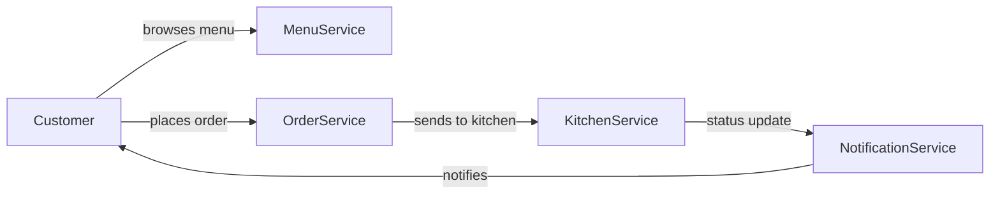
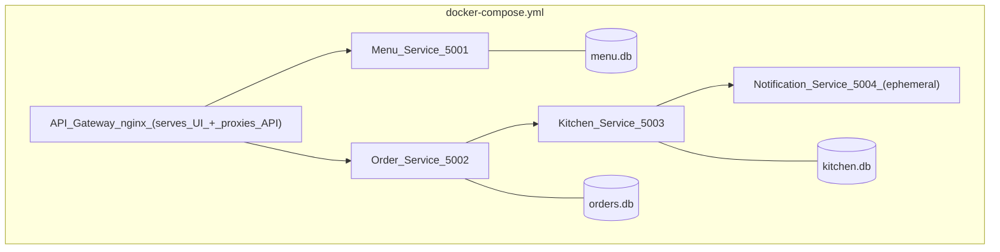
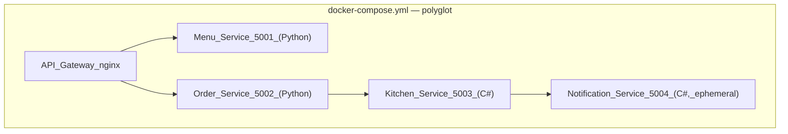

# Microservices Learning Project: "Pizza Shop"

## Why This Design

The biggest mistake in learning microservices is jumping straight to Kubernetes without understanding **why** microservices exist. This project follows the real-world journey:

1. Build a monolith
2. Feel the pain points
3. Decompose into services
4. Deploy to Kubernetes and see the operational benefits
5. Rewrite select services in a different language to experience polyglot microservices

The domain (pizza ordering) is simple enough to focus on architecture, not business logic.

## The Domain




Four bounded contexts, each becoming its own service:

- **Menu** — list pizzas, prices, availability
- **Orders** — accept orders, track status
- **Kitchen** — simulate cooking (with artificial delay), update status
- **Notifications** — log/display status changes (simulated push notifications)

---

## ARM Mac Notes (Apple Silicon)

This project is developed on an ARM64 (Apple Silicon) Mac. Key implications:

- **Docker images**: All Dockerfiles must build for `linux/arm64`. The Python (`python:3.11-slim`) and .NET (`mcr.microsoft.com/dotnet/aspnet:9.0`, `mcr.microsoft.com/dotnet/sdk:9.0`) base images all have native ARM64 variants, so no emulation is needed.
- **minikube driver**: Use `minikube start --driver=docker` (default on Docker Desktop for Mac). The `docker` driver runs natively on ARM64. Avoid the `hyperkit` driver — it does not support ARM.
- **minikube image workflow**: Prefer `minikube image load <image>:<tag>` over `eval $(minikube docker-env)` — the latter can have inconsistencies on ARM. Alternatively, `eval $(minikube docker-env)` works but test it once before committing to it.
- **nginx**: The standard `nginx:alpine` image supports ARM64 natively.
- **Load testing**: `hey` is available via `brew install hey` and runs natively on ARM.

No cross-compilation or emulation (QEMU/Rosetta) is needed for any phase of this project.

## Phase 0: Local Environment Bootstrap (day 0)

Set up a repeatable local Kubernetes environment before writing app code.

Core bootstrap steps:

- `minikube start --driver=docker`
- `minikube addons enable ingress`
- `minikube addons enable metrics-server`
- Pick one local image workflow and stick to it:
  - Build normally and run `minikube image load <image>:<tag>` (recommended on ARM Mac), or
  - `eval $(minikube docker-env)` and build images directly into minikube's Docker daemon
- Set `imagePullPolicy: Never` in all Kubernetes Deployment manifests to avoid pulling from a remote registry.

Why this matters:

- Ingress examples fail without the ingress addon.
- HPA examples fail or show `unknown` metrics without metrics-server.
- Local images fail with `ImagePullBackOff` unless both the image workflow AND `imagePullPolicy: Never` are set.
- On ARM Mac, the wrong minikube driver or missing ARM64 base images cause subtle runtime failures.

## Phase 1: The Monolith (day 1)

Build a single FastAPI app with a single SQLite database containing all four domains as routers (FastAPI's equivalent of blueprints). Includes a simple browser UI to visually interact with the pizza shop — browse the menu, place orders, and watch kitchen/notification status updates.

**What you learn:**

- Everything in one codebase, one process, one database
- Easy to build initially
- The UI is just static files served by the same process — tightly coupled to the backend

---

### 1.1 Data Models

One shared SQLite database (`pizza_shop.db`) with all tables in a single `models.py`. Uses SQLAlchemy ORM with FastAPI's dependency injection for sessions.

**`menu_items` table:**

| Column      | Type         | Notes                          |
| ----------- | ------------ | ------------------------------ |
| id          | INTEGER (PK) | Auto-increment                 |
| name        | TEXT         | e.g. "Margherita"              |
| description | TEXT         | e.g. "Classic tomato and mozzarella" |
| price       | REAL         | e.g. 9.99                      |
| available   | BOOLEAN      | Default true, can be toggled   |

**`orders` table:**

| Column     | Type         | Notes                                               |
| ---------- | ------------ | --------------------------------------------------- |
| id         | INTEGER (PK) | Auto-increment                                      |
| status     | TEXT         | One of: `placed`, `pending`, `preparing`, `ready`, `delivered` |
| total      | REAL         | Sum of item prices                                  |
| created_at | DATETIME     | Auto-set on creation                                |
| updated_at | DATETIME     | Auto-updated on status change                       |

**`order_items` table** (join table — an order can have multiple pizzas):

| Column       | Type         | Notes                    |
| ------------ | ------------ | ------------------------ |
| id           | INTEGER (PK) | Auto-increment           |
| order_id     | INTEGER (FK) | References `orders.id`   |
| menu_item_id | INTEGER (FK) | References `menu_items.id` |
| quantity     | INTEGER      | Default 1                |

**`kitchen_queue` table:**

| Column     | Type         | Notes                                            |
| ---------- | ------------ | ------------------------------------------------ |
| id         | INTEGER (PK) | Auto-increment                                   |
| order_id   | INTEGER (FK) | References `orders.id` (unique — one entry per order) |
| status     | TEXT         | One of: `queued`, `cooking`, `done`              |
| started_at | DATETIME     | Set when cooking begins                          |
| done_at    | DATETIME     | Set when cooking finishes                        |

**`notifications` table:**

| Column     | Type         | Notes                                            |
| ---------- | ------------ | ------------------------------------------------ |
| id         | INTEGER (PK) | Auto-increment                                   |
| order_id   | INTEGER (FK) | References `orders.id`                           |
| message    | TEXT         | e.g. "Order #3 is now preparing"                 |
| created_at | DATETIME     | Auto-set on creation                             |

On startup, the app seeds the `menu_items` table with a handful of default pizzas if the table is empty.

---

### 1.2 API Endpoints

All endpoints are JSON. Four routers, each in its own file under `routers/`.

**Menu router (`/menu`):**

| Method | Path        | Description              | Request Body       | Response                  |
| ------ | ----------- | ------------------------ | ------------------ | ------------------------- |
| GET    | `/menu`     | List all available pizzas | —                  | `[{id, name, description, price, available}]` |
| GET    | `/menu/{id}`| Get one pizza by ID      | —                  | `{id, name, description, price, available}` |

**Orders router (`/orders`):**

| Method | Path             | Description                     | Request Body                                    | Response                          |
| ------ | ---------------- | ------------------------------- | ----------------------------------------------- | --------------------------------- |
| POST   | `/orders`        | Place a new order               | `{items: [{menu_item_id, quantity}]}`          | `{id, status, total, items, created_at}` |
| GET    | `/orders`        | List all orders                 | —                                               | `[{id, status, total, created_at}]` |
| GET    | `/orders/{id}`   | Get order detail with items     | —                                               | `{id, status, total, items, created_at, updated_at}` |

When an order is placed:
1. Validate that all `menu_item_id`s exist and are available
2. Calculate `total` from item prices × quantities
3. Insert into `orders` with status `placed`
4. Insert rows into `order_items`
5. Insert into `kitchen_queue` with status `queued`
6. Insert a notification: "Order #{id} placed"

**Kitchen router (`/kitchen`):**

| Method | Path                    | Description                          | Request Body | Response                                |
| ------ | ----------------------- | ------------------------------------ | ------------ | --------------------------------------- |
| GET    | `/kitchen/queue`        | List all kitchen queue entries       | —            | `[{id, order_id, status, started_at, done_at}]` |
| POST   | `/kitchen/cook/{order_id}` | Start cooking an order (simulated) | —            | `{order_id, status: "cooking"}`        |

The `cook` endpoint:
1. Set `kitchen_queue.status` to `cooking`, set `started_at` to now
2. Update `orders.status` to `preparing`
3. Insert notification: "Order #{id} is now preparing"
4. Simulate cooking with `time.sleep(5)` inside an `async def` handler — this is a **deliberate anti-pattern** that blocks the entire event loop for 5 seconds
5. Set `kitchen_queue.status` to `done`, set `done_at` to now
6. Update `orders.status` to `ready`
7. Insert notification: "Order #{id} is ready!"

**Why `time.sleep(5)` and not `await asyncio.sleep(5)`:** `await asyncio.sleep()` is cooperative — it yields control back to the event loop, letting other requests proceed normally. That would NOT demonstrate the monolith pain point. Using `time.sleep()` inside an `async def` is a classic mistake that blocks the event loop entirely: no other request can be served for those 5 seconds. This is exactly the behavior we want for the "aha" exercise. (In Phase 2, the kitchen-service runs in its own container, so this blocking only affects its own process — menu-service is unaffected.)

**Notifications router (`/notifications`):**

| Method | Path                       | Description                      | Request Body | Response                               |
| ------ | -------------------------- | -------------------------------- | ------------ | -------------------------------------- |
| GET    | `/notifications`           | List all notifications (newest first) | —        | `[{id, order_id, message, created_at}]` |
| GET    | `/notifications/{order_id}`| Notifications for a specific order | —          | `[{id, order_id, message, created_at}]` |

---

### 1.3 Pydantic Schemas

Defined alongside the routers or in a shared `schemas.py`. These define the request/response shapes and provide automatic validation.

```python
# Request schemas
class OrderItemRequest(BaseModel):
    menu_item_id: int
    quantity: int = 1

class CreateOrderRequest(BaseModel):
    items: list[OrderItemRequest]

# Response schemas
class MenuItemResponse(BaseModel):
    id: int
    name: str
    description: str
    price: float
    available: bool

class OrderResponse(BaseModel):
    id: int
    status: str
    total: float
    created_at: datetime
    updated_at: datetime | None

class KitchenQueueResponse(BaseModel):
    id: int
    order_id: int
    status: str
    started_at: datetime | None
    done_at: datetime | None

class NotificationResponse(BaseModel):
    id: int
    order_id: int
    message: str
    created_at: datetime
```

---

### 1.4 Application Wiring (`main.py`)

```python
app = FastAPI(title="Pizza Shop Monolith")

# Create all tables on startup
@app.on_event("startup")
async def startup():
    create_tables()
    seed_menu()

# Mount routers
app.include_router(menu_router, prefix="/menu", tags=["Menu"])
app.include_router(orders_router, prefix="/orders", tags=["Orders"])
app.include_router(kitchen_router, prefix="/kitchen", tags=["Kitchen"])
app.include_router(notifications_router, prefix="/notifications", tags=["Notifications"])

# Serve static UI files — this line goes LAST so it doesn't shadow API routes
app.mount("/", StaticFiles(directory="static", html=True), name="static")
```

Run with: `uvicorn main:app --reload --port 8000`

Available at:
- UI: `http://localhost:8000/`
- Swagger: `http://localhost:8000/docs`
- API: `http://localhost:8000/menu`, `/orders`, `/kitchen/queue`, `/notifications`

---

### 1.5 Database Layer

Uses SQLAlchemy with a synchronous SQLite connection (simple for a monolith). A `database.py` file provides:

- `engine` — `create_engine("sqlite:///pizza_shop.db")`
- `SessionLocal` — the session factory
- `get_db()` — FastAPI dependency that yields a session and closes it after the request

All routers use `db: Session = Depends(get_db)` to get a database session.

---

### 1.6 The UI

A simple single-page interface built with plain HTML, CSS, and vanilla JavaScript (no frameworks). Served by FastAPI using `StaticFiles` middleware. Talks to the backend via `fetch()` calls to the REST endpoints.

**Layout — single page with tab-style navigation:**

```
┌──────────────────────────────────────────────────────────────┐
│  🍕 Pizza Shop                                               │
│  [Menu]  [Place Order]  [My Orders]  [Kitchen]  [Notifications] │
├──────────────────────────────────────────────────────────────┤
│                                                              │
│  (content area changes based on active tab)                  │
│                                                              │
└──────────────────────────────────────────────────────────────┘
```

**Menu tab:**
- Fetches `GET /menu` on load
- Displays a card grid of pizzas: name, description, price, availability badge
- Each card has a "Add to Order" button that adds it to a client-side cart (stored in JS, not the backend)

**Place Order tab:**
- Shows the current cart: list of items with quantities, running total
- "+" and "−" buttons to adjust quantities, "Remove" to delete
- "Place Order" button that sends `POST /orders` with the cart contents
- On success: clears the cart, shows confirmation with order ID, links to order status

**My Orders tab:**
- Fetches `GET /orders` on load (or manual refresh button)
- Table: order ID, status (with colored badges: blue=placed, yellow=pending, orange=preparing, green=ready, gray=delivered), total, time placed
- Click an order row to expand and show its items via `GET /orders/{id}`

**Kitchen tab:**
- Fetches `GET /kitchen/queue` on load
- Shows queued orders with a "Start Cooking" button next to each
- Clicking "Start Cooking" calls `POST /kitchen/cook/{order_id}`
- UI shows a spinner/progress indicator during the 5-second cooking simulation
- When done, the status updates to "done"

**Notifications tab:**
- Fetches `GET /notifications` on load
- Shows a reverse-chronological feed of notification messages
- Auto-refreshes every 3 seconds (simple polling via `setInterval`)
- Each notification shows: timestamp, order ID, message
- In Phase 1 (monolith), notifications are durable (stored in SQLite alongside everything else)
- In Phase 2+, notifications are ephemeral (in-memory). The UI shows a small banner: "Notifications are ephemeral — restarting the notification service clears history." This is a deliberate teaching moment about the statefulness tradeoff.

**Styling (`style.css`):**
- Clean, minimal design — light background, card-based layout
- Status badges with distinct colors (blue/orange/green/gray)
- Responsive enough to work on a laptop screen
- No CSS framework — just vanilla CSS with flexbox/grid

**JavaScript (`app.js`):**
- One file, no build step, no modules
- `fetch()` wrapper function with error handling
- Tab switching via showing/hiding `<div>` sections
- Client-side cart as a simple JS array
- Polling function for notifications

---

### 1.7 Seed Data

On startup, if `menu_items` is empty, seed with:

| Name               | Description                              | Price |
| ------------------ | ---------------------------------------- | ----- |
| Margherita         | Classic tomato sauce and mozzarella      | 9.99  |
| Pepperoni          | Mozzarella and spicy pepperoni           | 11.99 |
| Hawaiian           | Ham and pineapple                        | 12.49 |
| Veggie Supreme     | Bell peppers, olives, onions, mushrooms  | 13.99 |
| BBQ Chicken        | BBQ sauce, grilled chicken, red onion    | 14.49 |

---

### 1.8 Dependencies (`requirements.txt`)

```
fastapi
uvicorn[standard]
sqlalchemy
pydantic
```

No external HTTP client needed in Phase 1 (everything is in-process). `uvicorn[standard]` includes `uvloop` and `httptools` for performance.

---

### 1.9 Project Structure (final)

```
monolith/
  main.py              # FastAPI app: mounts routers, serves static files
  database.py          # engine, SessionLocal, get_db dependency
  models.py            # SQLAlchemy table definitions (all 5 tables)
  schemas.py           # Pydantic request/response models
  routers/
    menu.py            # GET /menu, GET /menu/{id}
    orders.py          # POST /orders, GET /orders, GET /orders/{id}
    kitchen.py         # GET /kitchen/queue, POST /kitchen/cook/{order_id}
    notifications.py   # GET /notifications, GET /notifications/{order_id}
  static/
    index.html         # single-page UI shell with tab navigation
    style.css          # minimal clean styling
    app.js             # fetch() calls, tab switching, cart logic, polling
  requirements.txt
  Dockerfile
```

---

### 1.10 Implementation Order

Build in this sequence so you can test incrementally:

1. **`database.py` + `models.py`** — set up the engine, define all tables, verify they create with a quick script
2. **`schemas.py`** — define all Pydantic models
3. **`routers/menu.py`** — implement menu endpoints, seed data on startup
4. **`main.py`** (minimal) — wire up just the menu router, run with `uvicorn`, test with `/docs`
5. **`routers/orders.py`** — implement order creation and listing, test via Swagger
6. **`routers/kitchen.py`** — implement queue listing and cook endpoint with `time.sleep` (deliberately blocking), test the delay
7. **`routers/notifications.py`** — implement notification listing, verify notifications are created by orders and kitchen
8. **`static/index.html` + `style.css` + `app.js`** — build the UI, mount `StaticFiles` in `main.py`
9. **End-to-end test** — browse menu → add to cart → place order → start cooking → watch notifications
10. **Dockerfile** — containerize for use in Phase 2

---

### 1.11 The "Aha" Exercises (Simulating Pain)

Run these after the monolith is working to feel why microservices exist:

1. **Coupled deployment**: Change a string in `routers/kitchen.py`, restart the server — the menu UI goes down during restart. Every domain is affected by every deploy.

2. **Startup failure cascade**: Add a deliberate `raise ImportError("broken")` at the top of `routers/notifications.py`. The entire app fails to start — you can't even browse the menu. One bad domain kills everything.

3. **Resource contention**: Open two browser tabs. In tab 1, start cooking an order (5-second `time.sleep` blocks the event loop). In tab 2, immediately try to load the menu. The menu request hangs until cooking finishes because `time.sleep` inside `async def` blocks the entire event loop — no requests can be served during those 5 seconds. This is the monolith scaling problem. (Note: `await asyncio.sleep()` would NOT produce this effect because it yields control. The blocking `time.sleep` is a deliberate anti-pattern to make the pain visceral.)

4. **Shared codebase pain**: Look at `models.py` — all 5 tables in one file. Imagine 4 teams all editing this file simultaneously. Merge conflicts, accidental schema changes affecting other domains, no clear ownership.

Bonus: FastAPI gives us automatic `/docs` (Swagger UI) for free — useful for testing and for understanding API contracts. The custom UI is for a more realistic user-facing experience.

---

### 1.12 How the UI Evolves Across Phases

The UI files (HTML/CSS/JS) stay almost identical. Only the serving mechanism changes:

| Phase | Served by | URL | API base URL in JS |
| ----- | --------- | --- | ------------------ |
| Phase 1 | FastAPI `StaticFiles` | `http://localhost:8000/` | `/` (same origin) |
| Phase 2 | nginx gateway container (dual role: static files + reverse proxy) | `http://localhost:8080/` | `/api/` (nginx proxies to services) |
| Phase 3 | Dedicated nginx frontend pod (static files only); Ingress handles routing | `http://pizza.local/` | `/api/` (Ingress routes to services) |

Code changes between phases are minimal: the base URL prefix for `fetch()` calls (a single config variable at the top of `app.js`) and the Notifications tab gains an "ephemeral" banner in Phase 2+ to reflect the in-memory storage tradeoff.

---

### 1.13 Done When

- One FastAPI app serves all four domains from one process.
- One shared SQLite database powers all features.
- The browser UI can browse the menu, place an order, start cooking, and see notifications.
- `/docs` (Swagger UI) shows all endpoints with correct schemas.
- The "aha" exercises demonstrate coupled deployment, startup failure cascade, and resource contention.
- Restarting the app for one domain impacts all domains (including the UI).

## Phase 2: Decompose into Microservices + Docker Compose (day 2)

Break the monolith into 4 independent FastAPI services, each with its own Dockerfile and port. Stateful services (menu, orders, kitchen) each get their own SQLite database. The notification service is deliberately **ephemeral** — in-memory storage only, no database on disk. Each service gets its own `/docs` — now each team owns their own API contract.

The static UI files move from FastAPI to **nginx**, which now serves dual duty: API gateway (reverse proxy to backend services) and static file server (serves the HTML/CSS/JS). This is the standard production pattern — the gateway handles the frontend and routes `/api/*` to the appropriate backend service. The UI code itself doesn't change, only the `fetch()` base URLs (which now go through the gateway).



Design decisions to discuss:

- **SQLite per service** keeps things simple. Each service owns its own `.db` file. This limits each stateful service to a single replica, which is fine for learning. In production, you would use PostgreSQL or a managed database to enable multi-replica scaling.
- **Notification service is ephemeral-stateful** — it receives events via `POST /notifications`, stores them in an in-memory list (no database on disk), and serves them back via `GET /notifications`. Restarting the service clears all notification history. This is a deliberate tradeoff: no disk I/O makes it lightweight and fast to scale horizontally, but data doesn't survive restarts. When scaled to multiple replicas behind a load balancer, each replica has a partial view of notifications (requests are round-robined). Both tradeoffs are explicitly surfaced in the UI and called out as teaching moments. In production you'd back this with Redis or a message queue for shared durable state.
- **Graceful degradation with reconciliation**: When placing an order, order-service calls `POST /kitchen/orders` on kitchen-service with a short timeout (e.g., 3 seconds). If kitchen is slow or down, order-service catches the error and sets the order status to `pending` rather than failing the request. The order is accepted — the customer sees confirmation. To avoid dropping pending orders, **order-service owns the retry loop**: a background `asyncio` task runs every 30 seconds, queries its own DB for orders with status `pending`, and re-attempts the `POST /kitchen/orders` call for each one. Once kitchen-service accepts, order-service updates the status from `pending` to `placed` and the normal flow continues. Kitchen-service does not need to know about pending orders — it just receives orders and queues them. This is a simplified version of the outbox pattern — good enough for learning, with the production alternative (message queue or transactional outbox) explicitly called out.

**What you learn:**

- Each service is its own codebase, its own container, its own database (database-per-service pattern)
- Not every service needs a persistent database — ephemeral in-memory storage trades durability for simplicity and speed
- Services communicate over HTTP (REST) — they find each other by Docker DNS names
- An nginx API gateway routes external traffic AND serves the frontend — the standard pattern
- The UI didn't change, only where it's served from — frontend is decoupled from backend services
- Independent deployment: restart just the kitchen service, menu keeps working
- Failure isolation: kill notification service, orders still go through (because callers use best-effort fire-and-forget — see below)
- Graceful degradation: kitchen being slow does not block order acceptance

**Notification call pattern — best-effort fire-and-forget:**

All callers (kitchen-service, order-service) call `POST /notifications` inside a try/except with a short timeout (e.g., 2 seconds). If the call fails or times out, the caller logs the failure and continues — the primary operation (cooking, order placement) is never blocked by a notification failure. This is what makes `docker compose stop notifications` safe: orders still work, you just lose the notification side-effect. The UI handles this by showing "Notification service unavailable" in the Notifications tab when `GET /notifications` returns an error.
- **The tradeoff**: more operational complexity (more containers, networking, etc.)

**Key exercises:**

- `docker compose up`, then `docker compose restart kitchen` — menu stays up, UI stays up
- `docker compose stop notifications` — orders still work, just no notifications; UI shows the degraded state
- Change menu prices — redeploy only the menu service
- Stop a backend service — the UI still loads (served by nginx), but API calls to that service fail gracefully

Structure:

```
microservices/
  docker-compose.yml
  gateway/
    nginx.conf
    static/              # UI files, served by nginx directly
      index.html
      style.css
      app.js
    Dockerfile
  menu-service/
    main.py
    models.py
    Dockerfile
    requirements.txt
  order-service/
    main.py
    models.py
    Dockerfile
    requirements.txt
  kitchen-service/
    main.py
    models.py
    Dockerfile
    requirements.txt
  notification-service/
    main.py
    Dockerfile
    requirements.txt
```

### Contract Tests (introduced in Phase 2, reused through Phase 5)

The main risk across decomposition and polyglot rewrites is interface drift — a service changes a field name or status code and callers silently break. To catch this early, introduce a lightweight contract test suite starting in Phase 2.

**Two test files:**

**`tests/test_contracts.py`** — validates response shapes, status codes, and key field names. Does NOT test business logic — only that the API contract hasn't drifted.

Example contract tests:
- `GET /api/menu` returns 200 with a list of objects each containing `id`, `name`, `price`, `available`
- `POST /api/orders` with valid items returns 201 with an object containing `id`, `status`, `total`
- `GET /api/kitchen/queue` returns 200 with a list of objects each containing `order_id`, `status`
- `GET /api/notifications` returns 200 with a list of objects each containing `order_id`, `message`

**`tests/test_resilience.py`** — validates the behavioral claims the plan depends on: graceful degradation and failure isolation.

Example resilience tests:
- **Kitchen unavailable → order becomes pending → retry reconciles:** Stop kitchen-service (`docker compose stop kitchen`). Place an order via `POST /api/orders`. Assert response is 201 and status is `pending`. Restart kitchen-service (`docker compose start kitchen`). Wait for the reconciliation loop (~30s). Poll `GET /api/orders/{id}` until status changes from `pending` to `placed` (with a timeout). Assert kitchen queue now contains the order.
- **Notification outage does not fail order placement:** Stop notification-service (`docker compose stop notifications`). Place an order via `POST /api/orders`. Assert response is 201 (not 5xx). Start cooking via `POST /api/kitchen/cook/{order_id}`. Assert response is 200. Verify the full order flow completes (status reaches `ready`) despite notifications being down.

These tests use `docker compose` commands to simulate outages, so they only run in Phase 2+ (not against the monolith).

**When to run:**
- **Phase 2:** Run both suites against `docker compose` after all services are up. Contract tests validate decomposition preserved the API. Resilience tests validate the failure isolation and graceful degradation claims.
- **Phase 3:** Run both suites against the minikube Ingress endpoint (resilience tests use `kubectl scale ... --replicas=0` instead of `docker compose stop`).
- **Phase 5:** Run contract tests after the C# rewrite. This is the critical gate — if the C# kitchen-service returns `orderId` instead of `order_id`, the test catches it immediately. Resilience tests confirm the behavioral guarantees survive the language swap.

**Structure:**

```
tests/
  test_contracts.py    # pytest + httpx, validates response shapes
  test_resilience.py   # pytest + httpx + subprocess, validates failure isolation and degradation
  conftest.py          # base URL fixture, docker-compose/kubectl helpers
```

The `BASE_URL` is set via environment variable so the same tests run against Compose (`http://localhost:8080/api`), minikube (`http://pizza.local/api`), or any other deployment. The resilience tests also accept an `ORCHESTRATOR` env var (`compose` or `k8s`) to select the right stop/start commands.

Done when:

- Each service can be built and run independently.
- Restarting `kitchen-service` does not impact `menu-service` availability.
- Stopping `notification-service` does not block order creation.
- Contract tests pass against the Compose deployment.

## Phase 3: Graduate to Minikube + kubectl (day 3-4)

Deploy the same services to a local Kubernetes cluster. This is where the real power shows up.

**New Kubernetes concepts introduced one at a time:**


| Concept                   | What it teaches                                            | Manifest                      |
| ------------------------- | ---------------------------------------------------------- | ----------------------------- |
| Pod / Deployment          | A running instance of a service                            | `deployment.yaml` per service |
| Service (ClusterIP)       | How services find each other (DNS-based service discovery) | `service.yaml` per service    |
| ConfigMap                 | Externalized configuration                                 | `configmap.yaml`              |
| Secret                    | Credentials management                                     | `secret.yaml`                 |
| Ingress                   | Replaces nginx's routing/proxy role; a separate nginx pod still serves static UI files | `ingress.yaml`                |
| HorizontalPodAutoscaler   | Auto-scaling based on load                                 | `hpa.yaml` for notifications  |
| Liveness/Readiness probes | Health checking                                            | Added to deployments          |


**Key exercises (the "wow" moments):**

1. **Self-healing**: `kubectl delete pod kitchen-xxx` — watch Kubernetes restart it automatically
2. **Scaling**: `kubectl scale deployment notifications --replicas=3` — notification service handles write load (POST) in parallel since each replica independently accepts events. Read load (GET) returns a partial view because each replica has its own in-memory history — this is a visible tradeoff to discuss. Stateful services stay at 1 replica with SQLite.
3. **Rolling updates**: Change notification code, rebuild image, `kubectl rollout` — zero-downtime deploy
4. **Service discovery**: Services call `http://menu-service/menu` — Kubernetes DNS resolves the ClusterIP service (port 80 maps to container port)
5. **Observability**: `kubectl logs -f deployment/order-service` — centralized log tailing
6. **Config without redeploy**: Update a ConfigMap, restart pod — new config, same image

**Phase 3 topology — how nginx and Ingress coexist:**

In Phase 2, nginx served two roles: static file server AND reverse proxy. In Phase 3, those roles are split:
- **Ingress** takes over the reverse proxy / routing role (routes `/api/menu/*` to menu-service, `/api/orders/*` to order-service, etc.)
- **A dedicated `frontend` pod** (still nginx, but now just a static file server) serves the HTML/CSS/JS. Ingress routes `/` to this pod.

This is the standard Kubernetes pattern: Ingress handles routing, and each service (including the frontend) is just a pod behind a ClusterIP Service.

Structure:

```
k8s/
  frontend/
    deployment.yaml    # nginx pod serving static UI files
    service.yaml
  menu/
    deployment.yaml
    service.yaml
  orders/
    deployment.yaml
    service.yaml
  kitchen/
    deployment.yaml
    service.yaml
  notifications/
    deployment.yaml
    service.yaml
    hpa.yaml
  ingress.yaml         # routes / → frontend, /api/menu → menu-service, etc.
  configmap.yaml       # non-sensitive config (feature flags, service URLs)
  secret.yaml          # sensitive values (DB credentials, API keys)
```

Implementation notes:

- Set CPU/memory requests in deployments so HPA can scale meaningfully in minikube.
- Set `imagePullPolicy: Never` on all containers to use locally built images.
- Stateful services (menu, orders, kitchen) run as 1 replica with SQLite. Notification service scales for write throughput (each replica accepts POSTs independently), but GET responses are replica-local — a known tradeoff documented in the exercises.
- The frontend pod reuses the same `gateway/static/` files from Phase 2 in a minimal nginx container.

Done when:

- `kubectl get pods` shows healthy replicas for all services.
- Deleting a pod triggers automatic replacement.
- Scaling notification-service replicas works for write throughput (POSTs are distributed). GET returns replica-local history — observe the partial-view tradeoff when curling the endpoint repeatedly across replicas.
- Ingress routes external requests to the correct backend services.
- Contract tests pass against the minikube Ingress endpoint.

## Phase 4: Moderate Depth Additions (day 4-5)

Once the basics click, layer on:

- **Health endpoints**: Each service exposes `/health` and `/ready` — Kubernetes uses these for liveness/readiness probes
- **Structured logging**: JSON logs with request IDs that flow across services (correlation IDs) — see a single order's journey across all 4 services
- **ConfigMaps and Secrets**: Move database URLs and feature flags into Kubernetes config
- **A simple load test**: Use `hey` or `ab` to hammer the notification endpoint, watch the HPA scale pods up, then scale down when load drops

Done when:

- `/health` and `/ready` are wired to liveness/readiness probes.
- Logs include a correlation ID that can be followed across at least two services.
- At least one config value is delivered through ConfigMap and one sensitive value via Secret.
- HPA scales up under load and scales down after load subsides.

## Phase 5: Polyglot — Rewrite Services in C# (day 5-6)

The ultimate proof that microservices support independent technology choices: rewrite two services in C# while the rest stay in Python. Nothing changes for the callers.

**Services to convert (in order):**

1. **notification-service** (easiest) — ephemeral in-memory storage, no database on disk, receives events and serves them back. A clean "hello world" for ASP.NET Core Minimal APIs in a container.
2. **kitchen-service** (more interesting) — has its own SQLite database, calls notification-service, has cooking simulation logic. Demonstrates C# + Entity Framework Core (or raw ADO.NET with `Microsoft.Data.Sqlite`) alongside Python services.

**Technology mapping:**

| Python (before)    | C# (after)                             |
| ------------------ | -------------------------------------- |
| FastAPI            | ASP.NET Core Minimal APIs (.NET 9)     |
| Pydantic models    | Records + Data Annotations             |
| `uvicorn`          | Built-in Kestrel server                |
| `httpx` (HTTP)     | `HttpClient` / `IHttpClientFactory`    |
| SQLite + SQLAlchemy| `Microsoft.Data.Sqlite` or EF Core     |
| `python:3.11-slim` | `mcr.microsoft.com/dotnet/aspnet:9.0`  |
| `/docs` (Swagger)  | Swagger via `Swashbuckle` (one line)   |

**What changes per service:**

- New `Program.cs` replacing `main.py`
- New `.csproj` file replacing `requirements.txt`
- New multi-stage `Dockerfile`:
  - Build stage: `mcr.microsoft.com/dotnet/sdk:9.0` (ARM64 native)
  - Runtime stage: `mcr.microsoft.com/dotnet/aspnet:9.0` (ARM64 native)
- Same API contract: identical routes, request/response JSON shapes, status codes

**What changes in deployment config:**

- `docker-compose.yml`: the `build.context` for kitchen-service and notification-service points to the new C# directories (`kitchen-service-csharp/`, `notification-service-csharp/`). Service names, ports, and network aliases stay the same — callers are unaffected.
- Kubernetes manifests: the `image` field in the Deployment changes (e.g., `kitchen-service:latest` now refers to a .NET image instead of a Python image). Everything else (Service, HPA, probes) stays identical.

**What does NOT change:**

- Other Python services — zero modifications
- Service discovery, health endpoints, correlation ID headers
- nginx / Ingress routing rules
- API contract (routes, JSON shapes, status codes)



Structure (new files alongside existing Python services):

```
microservices/
  kitchen-service-csharp/
    Program.cs
    KitchenService.csproj
    Models/
      KitchenOrder.cs
    Dockerfile
  notification-service-csharp/
    Program.cs
    NotificationService.csproj
    Dockerfile
```

**Key exercises:**

- Build and run with `docker compose up` — `kubectl get pods` or `docker ps` shows Python and C# containers side by side
- Hit `order-service` (Python) which calls `kitchen-service` (C#) which calls `notification-service` (C#) — seamless cross-language communication
- Compare the Swagger UI at `/docs` (FastAPI) vs `/swagger` (ASP.NET Core) — different frameworks, same API contract
- Scale the C# notification-service with HPA — same scaling behavior, different runtime
- Intentionally break the API contract in the C# kitchen-service (change a JSON field name) — watch order-service fail, fix it, redeploy just kitchen

**What you learn:**

- Microservices are language-agnostic — the API contract is the boundary, not the runtime
- Each team can choose the best language/framework for their service
- Docker abstracts away runtime differences — the orchestrator sees containers, not languages
- The cost: each language brings its own build tooling, debugging workflow, and dependency management
- The benefit: teams are not blocked by a single technology stack decision

Done when:

- `notification-service` runs in C# and responds identically to the Python version.
- `kitchen-service` runs in C# with its own SQLite database and calls the C# notification-service.
- `order-service` (still Python) calls `kitchen-service` (now C#) with no code changes.
- All health/ready endpoints and correlation IDs work across the language boundary.
- Both `docker compose` and minikube deployments work with the mixed-language setup.
- **Contract tests pass unchanged** — the same `test_contracts.py` that validated the Python services passes against the C# replacements with zero modifications. This is the definitive proof that the API contract is the boundary.

## Interview Talking Points This Builds

After completing this project, you will be able to speak authentically about:

- Why microservices exist (monolith pain at scale)
- Database-per-service and why shared databases are an anti-pattern
- Service discovery (Docker DNS vs. Kubernetes DNS)
- API gateway pattern
- Independent deployment and failure isolation
- Horizontal scaling of individual services
- Health checks and self-healing
- Polyglot microservices — choosing the best language per service
- The tradeoff: operational complexity vs. organizational scalability
- "A microservice is an organizational solution to an organizational problem"

## Expected Interview Answers (by phase)

Use these as short, credible responses tied to things he actually ran.

### Phase 1 (Monolith)

- "Monoliths are fast to start, but one deploy restarts everything."
- "Shared code and shared DB increase team coupling; one bad startup dependency can block the entire app."
- "I saw load in one area affect unrelated endpoints because everything shares one process."

### Phase 2 (Microservices on Compose)

- "Splitting by bounded context gave independent deployability and clearer ownership."
- "Each stateful service got its own SQLite database. The notification service used ephemeral in-memory storage — no disk database — making it lightweight and easy to scale, at the cost of losing history on restart."
- "I validated failure isolation by stopping notifications while order creation still worked, and graceful degradation by slowing kitchen while orders were still accepted."

### Phase 3 (Kubernetes / Minikube)

- "Kubernetes gives self-healing and declarative desired state; deleted pods were recreated automatically."
- "Service discovery moved from manual host config to DNS via ClusterIP services."
- "Ingress and HPA required cluster capabilities (ingress + metrics-server), which is an important real-world prerequisite."

### Phase 4 (Observability and Config)

- "Health probes separate liveness from readiness, which prevents routing traffic to not-ready pods."
- "Correlation IDs made cross-service tracing possible without a full tracing stack."
- "ConfigMap/Secret separation let us change runtime behavior without rebuilding images."

### Phase 5 (Polyglot)

- "I rewrote the kitchen service from Python to C# without changing a single line in order-service. The API contract is the boundary, not the language."
- "ASP.NET Core Minimal APIs are structurally very similar to FastAPI — the port was nearly 1:1 in route definitions and middleware."
- "Docker abstracts the runtime: Kubernetes saw containers, not languages. The same HPA, probes, and service discovery worked across Python and C#."
- "The real cost of polyglot is tooling diversity — different build systems, debuggers, and dependency managers per language."

### Tradeoff Summary (when asked why not always microservices?)

- "Microservices optimize for team autonomy and independent scaling, not raw simplicity."
- "For small teams and low change velocity, a modular monolith is often the better default."
- "The right architecture depends on organizational scale, deploy frequency, and failure isolation needs."

## Prerequisites to Install

Platform: ARM64 Mac (Apple Silicon). All tools below have native ARM64 support.

**Phases 1-4 (Python):**

- Python 3.11+ (`brew install python@3.11`)
- Docker Desktop for Mac (ARM native)
- minikube (`brew install minikube`)
- kubectl (`brew install kubectl`)
- A load testing tool (`brew install hey`)
- pytest + httpx (`pip install pytest httpx`) — for contract tests starting in Phase 2

**Phase 5 (C# / .NET):**

- .NET 9 SDK (`brew install dotnet@9`) — includes the `dotnet` CLI for building, running, and publishing ASP.NET Core apps. ARM64 native on macOS.
- No IDE required (VS Code with C# Dev Kit extension is optional but helpful for IntelliSense)

Cluster bootstrap commands (run once per machine setup):

- `minikube start --driver=docker`
- `minikube addons enable ingress`
- `minikube addons enable metrics-server`

## What I Will Generate

All the code for phases 1-5: the monolith, the decomposed Python services, docker-compose setup, all Kubernetes manifests, the C# rewrites of kitchen-service and notification-service, and a README with guided exercises. Each phase builds on the previous one so the progression feels natural.

## 15-Minute Mock Interview Script

Use this as a realistic drill. Keep answers concise (30-90 seconds each) and always tie back to what was actually implemented.

### Q1) What is a microservice?

Sample answer:
"A microservice is a small, independently deployable service aligned to a business capability. In my project, menu, orders, kitchen, and notifications were separate services. Each had its own API — stateful ones had their own database, and the notification service used ephemeral in-memory storage so it could scale write throughput horizontally, though reads were replica-local."

### Q2) Why not just keep a monolith?

Sample answer:
"A monolith is often the best starting point because it is simpler operationally. But at scale, team coupling becomes a bottleneck. In our monolith phase, one startup failure could block the whole app and one deployment restarted everything. Microservices traded simplicity for team autonomy and failure isolation."

### Q3) How do microservices communicate?

Sample answer:
"In this project, services communicated over HTTP REST. Under Docker Compose, service names resolved through container DNS. Under Kubernetes, ClusterIP services provided stable DNS names like `menu-service`."

### Q4) What did Kubernetes give you that Compose did not?

Sample answer:
"Kubernetes gave declarative desired state, self-healing, and native scaling controls. When I deleted a pod, it was recreated automatically. I scaled the ephemeral notification service with HPA for write throughput, while stateful services stayed at one replica with SQLite — in production I would use PostgreSQL for multi-replica stateful services and Redis for shared notification state."

### Q5) What is service discovery?

Sample answer:
"Service discovery is how a service finds another service at runtime. Instead of hardcoding IPs, we used logical names. In Kubernetes, DNS resolved service names to virtual IPs, so deployments could change without breaking callers."

### Q6) What is the role of an API gateway / Ingress?

Sample answer:
"It centralizes external entry, routing, and policy. In Compose, nginx routed requests to services. In Kubernetes, Ingress played that role. This keeps internal services private and gives one external access pattern."

### Q7) What are readiness and liveness probes?

Sample answer:
"Liveness checks if the container should be restarted; readiness checks if it should receive traffic. We used both so Kubernetes would not route requests to pods that were alive but not yet ready."

### Q8) How did you handle configuration and secrets?

Sample answer:
"Non-sensitive runtime config went to ConfigMap and sensitive values to Secret. That let us change behavior without rebuilding images and reduced hardcoded environment differences."

### Q9) How do you debug a request across services?

Sample answer:
"We used structured JSON logs and correlation IDs propagated in headers. That let us follow a single order from order-service to kitchen-service to notification-service through logs."

### Q10) What does "polyglot microservices" mean, and have you done it?

Sample answer:
"Polyglot means different services can use different languages or frameworks. I rewrote the kitchen and notification services from Python/FastAPI to C#/ASP.NET Core. The order service stayed in Python and called the C# kitchen service over HTTP with zero changes. Docker and Kubernetes don't care what language runs inside the container — they just manage containers. The tradeoff is that each language brings its own tooling and debugging story."

### Q11) What are the biggest microservices tradeoffs?

Sample answer:
"You gain independent deployability, scaling, and team ownership, but you pay in operational complexity: networking, observability, deployment pipelines, and distributed failure modes. That is why architecture should match organizational needs."

### Rapid-fire follow-ups (practice)

- "When would you keep a modular monolith?"  
"Small team, low deploy frequency, and limited scaling needs."
- "Can microservices share one database?"  
"Technically yes, but it creates tight coupling and defeats service ownership boundaries."
- "What failed first when moving to Kubernetes?"  
"Cluster prerequisites: ingress and metrics-server. Without them, Ingress/HPA demos do not behave correctly."
- "How would you improve this next?"  
"Replace SQLite with PostgreSQL to enable multi-replica stateful services, add async messaging (RabbitMQ or Kafka), distributed tracing (OpenTelemetry), and CI/CD pipelines that run the contract tests on every push."
- "What did you learn from the polyglot rewrite?"  
"That the API contract is the real interface — Python and C# services communicated seamlessly because they agreed on routes and JSON shapes. The orchestrator doesn't care about the language inside the container."

### 15-minute practice cadence

- 3 min: Explain architecture evolution (monolith -> compose -> kubernetes -> polyglot)
- 4 min: Core concepts (service discovery, gateway, probes, scaling)
- 3 min: Polyglot experience (what changed, what didn't, API contract as boundary)
- 3 min: Tradeoffs and decision-making ("when not to use microservices")
- 2 min: Lessons learned and next improvements

